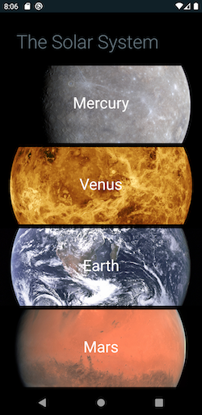
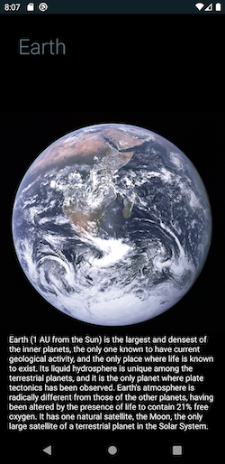

# SolarSystem

A basic app to learn Android and Kotlin using the solar system as a data source.

### Main Activity

Shows the planets of the Solar System, tapping one will take you to more details about the selected planet

### Planet Activity

Shows details of the planet, copied from Wikipedia... no magic lookup

